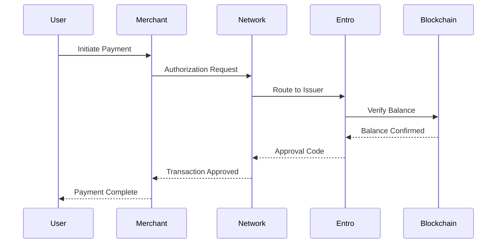

# Card System Infrastructure

The Entro Finance card system represents a breakthrough in bridging cryptocurrency and traditional payment networks. Our cards function as a direct gateway from your Solana wallet to millions of merchants worldwide.

## Card Types

### Virtual Cards

Instant issuance cards perfect for online transactions:

- **Issuance Time**: < 3 seconds
- **Availability**: Immediate after creation
- **Use Cases**: Online shopping, subscriptions, digital services
- **Security**: Dynamic CVV, merchant restrictions

### Physical Cards

Premium cards for in-person transactions:

- **Material**: Metal or eco-friendly plastic options
- **Chip Technology**: EMV chip with NFC capability
- **Delivery**: 3-5 business days express shipping
- **Personalization**: Custom designs available

## Technical Implementation

### Card Generation Process

```typescript
interface CardCreationParams {
  type: 'VIRTUAL' | 'PHYSICAL';
  currency: 'USD' | 'EUR' | 'GBP';
  design?: string;
  limits: {
    daily: number;
    monthly: number;
    perTransaction: number;
  };
}

async function createCard(params: CardCreationParams): Promise<Card> {
  // Generate unique card identifier
  const cardId = generateSecureId();
  
  // Create on-chain account
  const cardAccount = await program.methods
    .initializeCard(
      cardId,
      params.limits.daily,
      params.limits.monthly
    )
    .accounts({
      card: cardPDA,
      owner: wallet.publicKey,
      systemProgram: SystemProgram.programId,
    })
    .rpc();
  
  // Generate card numbers through secure HSM
  const cardDetails = await hsm.generateCardNumber({
    bin: '423456', // Entro BIN
    lastFour: randomDigits(4),
  });
  
  // Store encrypted card data
  await secureVault.store({
    id: cardId,
    number: encrypt(cardDetails.number),
    cvv: encrypt(cardDetails.cvv),
    expiry: cardDetails.expiry,
  });
  
  return new Card({
    id: cardId,
    ...cardDetails,
    status: 'ACTIVE'
  });
}
```

### Card Security Features

#### Dynamic CVV Technology

Our virtual cards feature rotating CVV codes:

```javascript
class DynamicCVV {
  constructor(cardId) {
    this.cardId = cardId;
    this.rotationInterval = 3600; // 1 hour
  }
  
  generateCVV(timestamp) {
    const seed = `${this.cardId}-${Math.floor(timestamp / this.rotationInterval)}`;
    const hash = crypto.createHash('sha256').update(seed).digest('hex');
    return hash.substring(0, 3).replace(/[a-f]/g, (match) => {
      return (parseInt(match, 16) % 10).toString();
    });
  }
  
  validateCVV(cvv, timestamp) {
    const currentCVV = this.generateCVV(timestamp);
    const previousCVV = this.generateCVV(timestamp - this.rotationInterval);
    
    // Allow current and previous CVV for edge cases
    return cvv === currentCVV || cvv === previousCVV;
  }
}
```

## Card Management Features

### Real-Time Controls

Users have complete control over their cards:

| Feature | Description | Response Time |
|---------|-------------|---------------|
| Freeze/Unfreeze | Instantly disable/enable card | < 100ms |
| Limit Adjustment | Modify spending limits | < 200ms |
| PIN Change | Update card PIN | < 150ms |
| Virtual Number Regeneration | Get new card number | < 3 seconds |

### Transaction Rules Engine

```python
class TransactionRules:
    def __init__(self, card_id):
        self.card_id = card_id
        self.rules = []
    
    def add_merchant_whitelist(self, merchants):
        self.rules.append({
            'type': 'WHITELIST',
            'merchants': merchants,
            'action': 'ALLOW'
        })
    
    def add_category_block(self, categories):
        self.rules.append({
            'type': 'CATEGORY_BLOCK',
            'categories': categories,  # e.g., ['gambling', 'atm']
            'action': 'DECLINE'
        })
    
    def add_country_restriction(self, allowed_countries):
        self.rules.append({
            'type': 'COUNTRY_FILTER',
            'countries': allowed_countries,
            'action': 'ALLOW_ONLY'
        })
    
    def evaluate_transaction(self, transaction):
        for rule in self.rules:
            if not self._check_rule(rule, transaction):
                return {
                    'approved': False,
                    'reason': f"Blocked by {rule['type']}"
                }
        
        return {'approved': True}
```

## Card Funding System

### Multi-Token Support

Cards can be funded with various tokens:

```solidity
contract CardFunding {
    mapping(address => bool) public supportedTokens;
    mapping(address => uint256) public tokenDecimals;
    
    event CardFunded(
        address indexed card,
        address indexed token,
        uint256 amount,
        uint256 usdValue
    );
    
    function fundCard(
        address cardAddress,
        address tokenAddress,
        uint256 amount
    ) external {
        require(supportedTokens[tokenAddress], "Token not supported");
        
        // Transfer tokens to card wallet
        IERC20(tokenAddress).transferFrom(
            msg.sender,
            cardAddress,
            amount
        );
        
        // Convert to USD value for card balance
        uint256 usdValue = oracle.getUSDValue(tokenAddress, amount);
        
        // Update card balance
        ICard(cardAddress).increaseBalance(usdValue);
        
        emit CardFunded(cardAddress, tokenAddress, amount, usdValue);
    }
}
```

### Auto-Reload Feature

Maintain card balance automatically:

```javascript
const autoReloadConfig = {
  enabled: true,
  threshold: 100, // Reload when balance < $100
  amount: 500,    // Reload $500
  source: {
    token: 'USDC',
    wallet: walletAddress
  },
  frequency: 'UNLIMITED' // or 'DAILY', 'WEEKLY', 'MONTHLY'
};

// Monitor and execute auto-reload
async function checkAutoReload(cardId) {
  const card = await getCard(cardId);
  const config = await getAutoReloadConfig(cardId);
  
  if (config.enabled && card.balance < config.threshold) {
    await fundCard({
      cardId: cardId,
      token: config.source.token,
      amount: config.amount,
      from: config.source.wallet
    });
    
    // Notify user
    await sendNotification({
      type: 'AUTO_RELOAD',
      message: `Card auto-reloaded with $${config.amount}`
    });
  }
}
```

## Card Network Integration

### Payment Network Compatibility

- **Visa**: Full integration with Visa Direct
- **Mastercard**: Mastercard Send enabled
- **Local Networks**: Support for regional payment systems

### Authorization Flow



## Performance Optimization

### Caching Strategy

```rust
pub struct CardCache {
    cache: Arc<RwLock<HashMap<String, CardData>>>,
    ttl: Duration,
}

impl CardCache {
    pub async fn get_card(&self, card_id: &str) -> Option<CardData> {
        let cache = self.cache.read().await;
        
        if let Some(data) = cache.get(card_id) {
            if data.timestamp.elapsed() < self.ttl {
                return Some(data.clone());
            }
        }
        
        // Cache miss - fetch from blockchain
        let card_data = self.fetch_from_chain(card_id).await?;
        
        // Update cache
        let mut cache = self.cache.write().await;
        cache.insert(card_id.to_string(), card_data.clone());
        
        Some(card_data)
    }
}
```

## Card Lifecycle Management

### States and Transitions

| State | Description | Available Actions |
|-------|-------------|-------------------|
| PENDING | Card created, awaiting activation | Activate, Cancel |
| ACTIVE | Card operational | All transactions |
| FROZEN | Temporarily disabled | Unfreeze, Close |
| EXPIRED | Past expiration date | Renew, Close |
| CLOSED | Permanently disabled | None |

## Next Steps

<CardGroup cols={2}>
  <Card
    title="Payment Processing"
    icon="money-bill-wave"
    href="/how-it-works/payment-processing"
  >
    Learn about transaction flows
  </Card>
  <Card
    title="Security Infrastructure"
    icon="lock"
    href="/how-it-works/security-infrastructure"
  >
    Explore security features
  </Card>
</CardGroup>