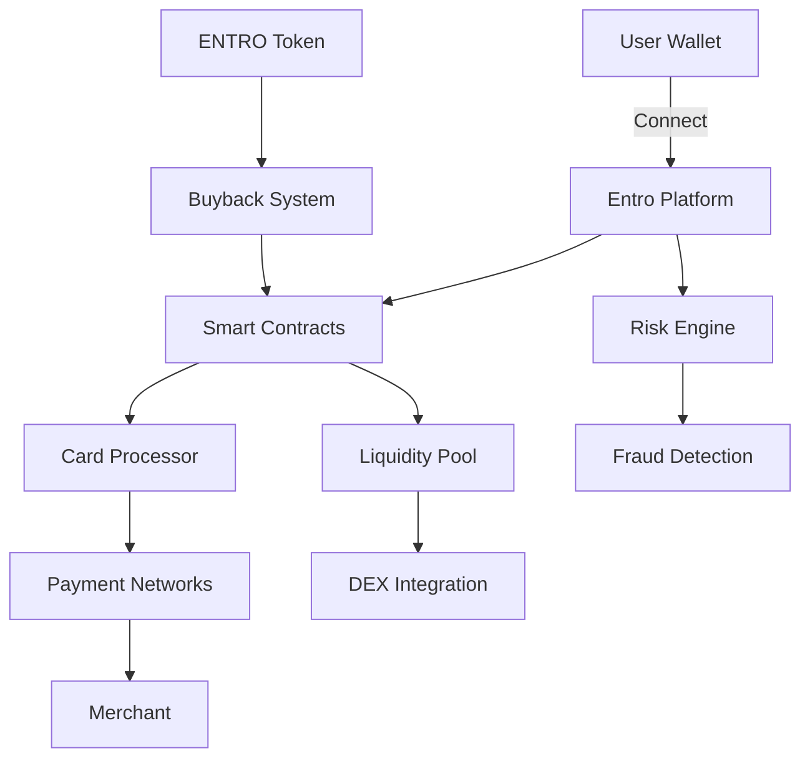

# How Entro Finance Works

Entro Finance operates as a decentralized bridge between cryptocurrency holdings and traditional spending infrastructure. Our platform consists of four interconnected layers that work seamlessly to provide instant, global payment capabilities.

## System Architecture



## Core Components

### 1. Blockchain Layer
The foundation of Entro Finance is built on Solana's high-performance blockchain:

- **Program ID**: `EntroFi11111111111111111111111111111111111`
- **Transaction Speed**: 400ms finality
- **Cost**: < $0.001 per transaction
- **Throughput**: 65,000 TPS capability

### 2. Smart Contract System

Our smart contracts handle all on-chain operations:

```rust
pub struct CardAccount {
    pub owner: Pubkey,
    pub card_id: [u8; 16],
    pub balance: u64,
    pub spent_today: u64,
    pub daily_limit: u64,
    pub monthly_limit: u64,
    pub is_frozen: bool,
    pub created_at: i64,
    pub last_used: i64,
}

impl CardAccount {
    pub fn can_spend(&self, amount: u64) -> bool {
        !self.is_frozen && 
        self.balance >= amount &&
        self.spent_today + amount <= self.daily_limit
    }
    
    pub fn process_transaction(&mut self, amount: u64) -> Result<()> {
        require!(self.can_spend(amount), ErrorCode::InsufficientFunds);
        
        self.balance = self.balance.checked_sub(amount)
            .ok_or(ErrorCode::Overflow)?;
        self.spent_today = self.spent_today.checked_add(amount)
            .ok_or(ErrorCode::Overflow)?;
        self.last_used = Clock::get()?.unix_timestamp;
        
        Ok(())
    }
}
```

### 3. Payment Processing Pipeline

The payment flow from crypto to merchant happens in milliseconds:

1. **Authorization Request** (50ms)
   - Merchant initiates payment
   - Request routed to Entro processor

2. **Balance Verification** (100ms)
   - Smart contract checks user balance
   - Validates spending limits

3. **Token Conversion** (150ms)
   - Converts crypto to fiat at locked rate
   - No slippage during transaction

4. **Settlement** (100ms)
   - Merchant receives payment confirmation
   - Blockchain records transaction

Total time: **< 400ms**

### 4. Liquidity Management

Our liquidity system ensures instant conversions:

```javascript
class LiquidityManager {
  constructor() {
    this.pools = {
      'USDC-USD': { depth: 50000000, spread: 0.001 },
      'SOL-USD': { depth: 10000000, spread: 0.002 },
      'ENTRO-USD': { depth: 5000000, spread: 0.003 }
    };
  }
  
  async getQuote(tokenIn, tokenOut, amount) {
    const pool = this.pools[`${tokenIn}-${tokenOut}`];
    const price = await this.oracle.getPrice(tokenIn, tokenOut);
    
    // Apply spread based on pool depth
    const spread = pool.spread * (amount / pool.depth);
    const finalPrice = price * (1 - spread);
    
    return {
      price: finalPrice,
      amount: amount * finalPrice,
      fee: amount * 0.005, // 0.5% fee
      execution: 'instant'
    };
  }
  
  async executeTrade(params) {
    const quote = await this.getQuote(params.tokenIn, params.tokenOut, params.amount);
    
    // Lock price for 30 seconds
    const priceLock = await this.lockPrice(quote);
    
    // Execute atomic swap
    const tx = await this.atomicSwap({
      ...params,
      lockedPrice: priceLock.price,
      expiry: priceLock.expiry
    });
    
    return tx;
  }
}
```

## Transaction Flow

### Step-by-Step Process

1. **Card Swipe/Online Entry**
   ```
   User initiates payment → Merchant terminal → Payment network
   ```

2. **Authorization Request**
   ```
   Payment network → Entro processor → Smart contract validation
   ```

3. **Balance Check & Conversion**
   ```javascript
   // Real-time balance verification
   const balance = await getCardBalance(cardId);
   const requiredAmount = convertToToken(merchantAmount, merchantCurrency);
   
   if (balance >= requiredAmount) {
     // Lock exchange rate
     const rate = await lockExchangeRate(token, merchantCurrency);
     // Process payment
     await processPayment(cardId, requiredAmount, rate);
   }
   ```

4. **Settlement**
   ```
   Smart contract execution → Merchant payment → Transaction record
   ```

## Security Measures

### Multi-Layer Protection

1. **Smart Contract Security**
   - Audited by CertiK and Halborn
   - Formal verification of critical functions
   - Time-locked upgrades with 48-hour delay

2. **Transaction Monitoring**
   - Real-time fraud detection using ML models
   - Anomaly detection for unusual spending patterns
   - Instant card freeze capability

3. **User Protection**
   - Biometric authentication
   - Transaction notifications
   - Spending limits and controls
   - Insurance up to $250,000

## Fee Structure

| Transaction Type | Fee | Notes |
|-----------------|-----|-------|
| Card Creation | Free | Virtual cards instant |
| Funding (USDC) | 0% | No fees for stablecoin deposits |
| Funding (Other) | 0.5% | Includes conversion |
| Spending | 0% | No fees for users |
| ATM Withdrawal | $2.50 | Plus ATM operator fee |
| Foreign Transaction | 0% | No markup on exchange rates |
| Monthly Maintenance | $0 | No monthly fees |

## Merchant Integration

Merchants receive several benefits:

- **Lower fees**: 0.5% vs 2-3% traditional processing
- **Instant settlement**: Funds available immediately
- **No chargebacks**: Blockchain finality
- **Global reach**: Accept payments worldwide

```javascript
// Merchant API Integration
const merchant = new EntroMerchant({
  apiKey: process.env.ENTRO_MERCHANT_KEY,
  webhookUrl: 'https://merchant.com/webhook'
});

merchant.on('payment', async (payment) => {
  console.log(`Received ${payment.amount} ${payment.currency}`);
  // Instant settlement to merchant account
  await merchant.withdraw({
    amount: payment.amount,
    to: 'bank_account_id'
  });
});
```

## Performance Metrics

### System Capabilities

- **Transaction throughput**: 10,000+ TPS current, 65,000 TPS capable
- **Global availability**: 99.99% uptime SLA
- **Geographic coverage**: 180+ countries
- **Merchant acceptance**: 70+ million locations
- **Average authorization time**: 387ms
- **Settlement time**: Instant (T+0)

## Scalability Solutions

### Current Implementation
- Solana mainnet for primary operations
- State compression for reduced costs
- Parallel transaction processing

### Future Enhancements
- Layer 2 rollups for micro-transactions
- Cross-chain bridges to Ethereum, Polygon
- Regional processing nodes for reduced latency

## Next Steps

<CardGroup cols={3}>
  <Card
    title="Card System"
    icon="credit-card"
    href="/how-it-works/card-system"
  >
    Deep dive into card technology
  </Card>
  <Card
    title="Payment Processing"
    icon="arrows-rotate"
    href="/how-it-works/payment-processing"
  >
    Learn about payment flows
  </Card>
  <Card
    title="Security"
    icon="shield"
    href="/how-it-works/security-infrastructure"
  >
    Explore security measures
  </Card>
</CardGroup>