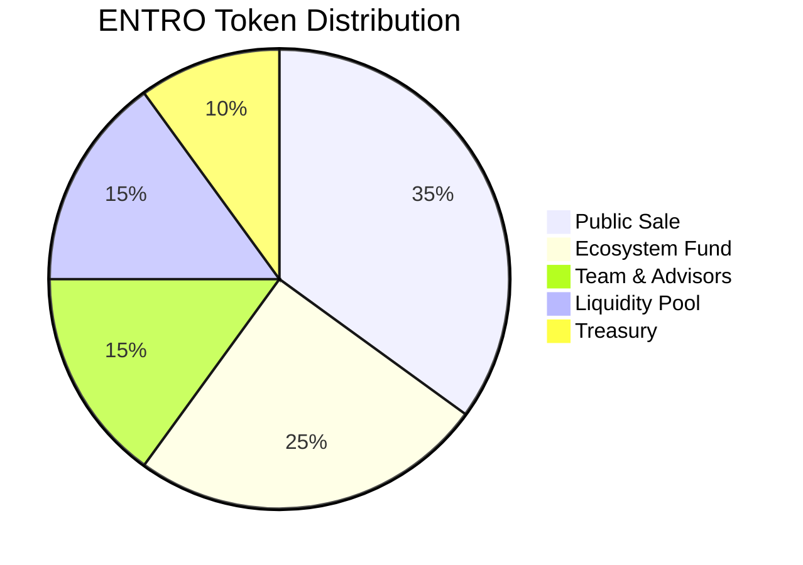

# ENTRO Tokenomics

The ENTRO token serves as the cornerstone of the Entro Finance ecosystem, creating a self-reinforcing flywheel between card usage and token value. Built on Solana using the SPL token standard, ENTRO connects everyday spending with decentralized finance benefits.

## Token Overview

### Basic Information

| Parameter | Value |
|-----------|-------|
| Token Name | Entro Finance |
| Symbol | ENTRO |
| Blockchain | Solana |
| Token Standard | SPL |
| Total Supply | 1,000,000,000 ENTRO |
| Decimals | 9 |
| Contract Address | `ENTRoKx7w9w2mNPqFfvXKkLJGRa8xYcQzfBL4YvWmjC` |

## Token Distribution

### Initial Allocation



### Detailed Breakdown

| Allocation | Percentage | Tokens | Vesting Schedule |
|------------|------------|--------|------------------|
| Public Sale | 35% | 350,000,000 | No vesting |
| Ecosystem Fund | 25% | 250,000,000 | 48 months linear |
| Team & Advisors | 15% | 150,000,000 | 12 months cliff, 36 months vest |
| Liquidity Pool | 15% | 150,000,000 | Locked until DEX launch |
| Treasury | 10% | 100,000,000 | DAO controlled |

## Vesting Schedule

### Smart Contract Implementation

```rust
use anchor_lang::prelude::*;
use anchor_spl::token::{self, Token, TokenAccount};

#[account]
pub struct VestingSchedule {
    pub beneficiary: Pubkey,
    pub mint: Pubkey,
    pub total_amount: u64,
    pub released_amount: u64,
    pub start_time: i64,
    pub cliff_time: i64,
    pub end_time: i64,
}

impl VestingSchedule {
    pub fn calculate_vested_amount(&self, current_time: i64) -> u64 {
        if current_time < self.cliff_time {
            return 0;
        }
        
        if current_time >= self.end_time {
            return self.total_amount;
        }
        
        let time_passed = current_time - self.cliff_time;
        let total_vesting_time = self.end_time - self.cliff_time;
        
        (self.total_amount as u128)
            .checked_mul(time_passed as u128)
            .unwrap()
            .checked_div(total_vesting_time as u128)
            .unwrap() as u64
    }
    
    pub fn available_to_claim(&self, current_time: i64) -> u64 {
        let vested = self.calculate_vested_amount(current_time);
        vested.saturating_sub(self.released_amount)
    }
}
```

## Token Utility

### Primary Use Cases

#### 1. Card Funding Bonus
Users receive a 2% bonus when funding cards with ENTRO:

```javascript
function calculateFundingAmount(token, amount) {
  let finalAmount = amount;
  
  if (token === 'ENTRO') {
    // Apply 2% bonus for ENTRO funding
    finalAmount = amount * 1.02;
    
    // Additional tier bonuses based on holdings
    const userBalance = getUserENTROBalance();
    
    if (userBalance >= 100000) { // Platinum tier
      finalAmount = amount * 1.05;
    } else if (userBalance >= 50000) { // Gold tier
      finalAmount = amount * 1.03;
    }
  }
  
  return finalAmount;
}
```

#### 2. Transaction Fee Reduction

ENTRO holders enjoy reduced fees based on tier:

| Tier | ENTRO Required | Card Fee Reduction | Merchant Fee |
|------|----------------|-------------------|--------------|
| Bronze | 1,000 | 10% | 0.45% |
| Silver | 10,000 | 25% | 0.40% |
| Gold | 50,000 | 50% | 0.35% |
| Platinum | 100,000 | 100% | 0.25% |

#### 3. Governance Rights

ENTRO holders participate in protocol governance:

```solidity
contract ENTROGovernance {
    struct Proposal {
        uint256 id;
        address proposer;
        string description;
        uint256 forVotes;
        uint256 againstVotes;
        uint256 startBlock;
        uint256 endBlock;
        bool executed;
    }
    
    mapping(uint256 => Proposal) public proposals;
    mapping(address => uint256) public votingPower;
    
    function calculateVotingPower(address user) public view returns (uint256) {
        uint256 balance = ENTRO.balanceOf(user);
        uint256 staked = stakingContract.stakedBalance(user);
        uint256 lockMultiplier = getLockMultiplier(user);
        
        return (balance + staked) * lockMultiplier / 100;
    }
    
    function vote(uint256 proposalId, bool support) external {
        Proposal storage proposal = proposals[proposalId];
        require(block.number >= proposal.startBlock, "Voting not started");
        require(block.number <= proposal.endBlock, "Voting ended");
        
        uint256 votes = calculateVotingPower(msg.sender);
        
        if (support) {
            proposal.forVotes += votes;
        } else {
            proposal.againstVotes += votes;
        }
        
        emit VoteCast(msg.sender, proposalId, support, votes);
    }
}
```

## Buyback Mechanism

### Revenue Sources for Buyback

1. **Card Transaction Fees**: 0.5% of transaction volume
2. **Interchange Revenue**: Share from payment networks
3. **Premium Services**: Subscription and upgrade fees
4. **Partner Commissions**: Revenue share from integrations

### Buyback Implementation

```python
class BuybackEngine:
    def __init__(self):
        self.revenue_pool = 0
        self.buyback_percentage = 0.5  # 50% of revenue for buybacks
        self.frequency = 'WEEKLY'
        
    def accumulate_revenue(self, amount, source):
        self.revenue_pool += amount
        
        # Track revenue sources
        self.log_revenue({
            'amount': amount,
            'source': source,
            'timestamp': time.time()
        })
    
    def execute_buyback(self):
        buyback_amount = self.revenue_pool * self.buyback_percentage
        
        # Execute market buy on DEX
        transaction = self.dex.market_buy(
            token='ENTRO',
            amount_usd=buyback_amount,
            slippage=0.01  # 1% max slippage
        )
        
        # Burn or redistribute tokens
        if transaction.success:
            self.process_bought_tokens(transaction.tokens_received)
            
        return transaction
    
    def process_bought_tokens(self, tokens):
        # 70% burned
        burn_amount = tokens * 0.7
        self.burn_tokens(burn_amount)
        
        # 30% to staking rewards
        stake_rewards = tokens * 0.3
        self.staking_contract.add_rewards(stake_rewards)
```

## Staking Program

### Staking Rewards Structure

```javascript
const stakingTiers = {
  flexible: {
    lockPeriod: 0,
    apy: 5,
    earlyWithdrawal: true
  },
  bronze: {
    lockPeriod: 30,
    apy: 8,
    earlyWithdrawal: false
  },
  silver: {
    lockPeriod: 90,
    apy: 12,
    earlyWithdrawal: false
  },
  gold: {
    lockPeriod: 180,
    apy: 18,
    earlyWithdrawal: false
  },
  platinum: {
    lockPeriod: 365,
    apy: 25,
    earlyWithdrawal: false
  }
};

function calculateRewards(amount, tier, days) {
  const tierData = stakingTiers[tier];
  const dailyRate = tierData.apy / 365 / 100;
  
  return amount * dailyRate * days;
}
```

## Token Metrics

### Supply Dynamics

| Metric | Current | Target (1 Year) | Target (3 Years) |
|--------|---------|-----------------|------------------|
| Circulating Supply | 350M | 500M | 750M |
| Staked Tokens | 0 | 200M | 400M |
| Burned Tokens | 0 | 50M | 200M |
| Average Hold Time | 0 days | 90 days | 180 days |

### Price Discovery

Initial liquidity will be provided through:
- **DEX Pools**: 10% of supply in Raydium/Orca
- **Market Making**: Professional MMs for CEX listings
- **Fair Launch**: No pre-sale price manipulation

## Economic Model

### Value Accrual Mechanisms

1. **Transaction Volume Growth**
   - More cards issued → More transactions
   - More transactions → More buyback revenue
   - More buybacks → Token price support

2. **Network Effects**
   - More users → Better merchant terms
   - Better merchant terms → Lower fees
   - Lower fees → More users

3. **Utility Expansion**
   - Governance participation
   - Premium feature access
   - Partner ecosystem benefits

### Financial Projections

```python
def project_token_value(months):
    projections = []
    
    # Initial values
    transaction_volume = 10_000_000  # $10M monthly
    token_price = 0.10
    circulating_supply = 350_000_000
    
    for month in range(months):
        # Growth assumptions
        transaction_volume *= 1.15  # 15% monthly growth
        buyback_amount = transaction_volume * 0.005 * 0.5
        
        # Price impact of buyback
        price_impact = buyback_amount / (circulating_supply * token_price) * 0.1
        token_price *= (1 + price_impact)
        
        # Vesting releases
        if month % 3 == 0:
            circulating_supply += 10_000_000
        
        projections.append({
            'month': month + 1,
            'volume': transaction_volume,
            'price': token_price,
            'market_cap': token_price * circulating_supply
        })
    
    return projections
```

## Next Steps

<CardGroup cols={2}>
  <Card
    title="Token Utility"
    icon="wrench"
    href="/tokenomics/utility"
  >
    Explore all ENTRO use cases
  </Card>
  <Card
    title="Buyback Mechanism"
    icon="chart-line"
    href="/tokenomics/buyback-mechanism"
  >
    Understand the buyback system
  </Card>
</CardGroup>