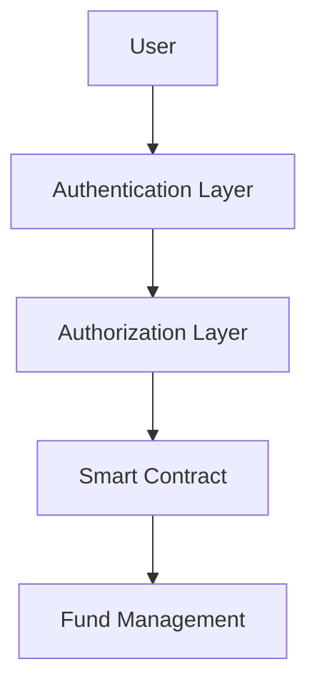

# Technical Architecture

## System Overview

Entro Finance is built on a modular, scalable architecture that combines the best of Layer 1 and Layer 2 solutions to deliver high-performance DeFi services.

## Core Components

### Smart Contract Layer
Our smart contracts are deployed across multiple chains with identical functionality:

```solidity
contract EntroCore {
    mapping(address => uint256) public userBalances;
    mapping(address => bool) public authorizedProtocols;
    
    function deposit(uint256 amount) external {
        // Implementation
    }
    
    function withdraw(uint256 amount) external {
        // Implementation
    }
}
```

### Cross-Chain Bridge
Our proprietary bridge technology enables seamless asset transfers:

<Accordion title="Bridge Architecture">
  <AccordionItem title="Validation Layer">
    Multi-signature validation with threshold cryptography
  </AccordionItem>
  <AccordionItem title="Relay Network">
    Decentralized relay nodes for transaction forwarding
  </AccordionItem>
  <AccordionItem title="Settlement Layer">
    Atomic swaps and proof verification
  </AccordionItem>
</Accordion>

## Security Framework

### Multi-Layer Security
- **Smart Contract Audits**: Regular audits by leading security firms
- **Formal Verification**: Mathematical proof of contract correctness
- **Bug Bounty Program**: Community-driven security testing
- **Insurance Coverage**: Protocol-level insurance for user funds

### Access Control


## Performance Metrics

| Metric | Target | Current |
|--------|--------|---------|
| Transaction Speed | < 2 seconds | 1.3 seconds |
| Network Uptime | 99.9% | 99.95% |
| Gas Optimization | 40% reduction | 38% reduction |

<Card title="Next: Security Details" icon="shield" href="/whitepaper/security">
  Learn more about our security measures
</Card>